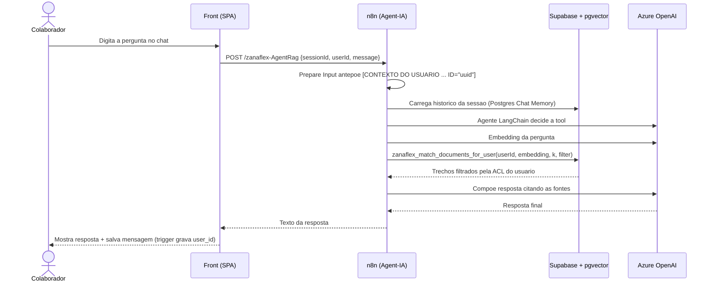
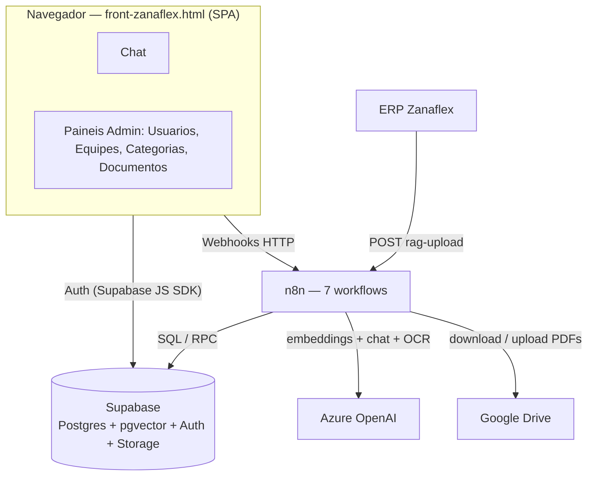
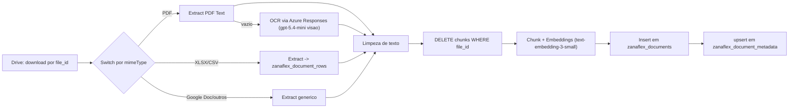
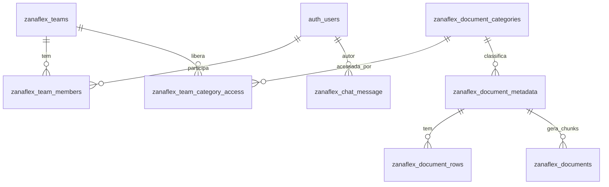

# Documentação do Projeto Zanaflex — Agente de IA + RAG

**Versão:** 1.0
**Data:** 24/06/2026
**Autor:** Doc Master
**Projeto:** Zanaflex — Agente IA com RAG, ACL por equipe e integração com ERP

---

## Sumário Executivo

A **Zanaflex** é uma indústria que mantém um grande acervo de documentos internos — **Instruções de Trabalho (IT)**, **Normas Regulamentadoras (NR)** e procedimentos operacionais. Encontrar a informação certa nesse acervo, com a garantia de que cada colaborador só enxerga o que pode ver, é um problema real de produtividade e de conformidade.

Este projeto entrega um **agente de inteligência artificial** que responde perguntas em linguagem natural sobre esses documentos, usando a técnica de **RAG (Retrieval-Augmented Generation)**: o agente busca os trechos mais relevantes na base vetorial e responde citando as fontes. O diferencial é o **controle de acesso por equipe e categoria (ACL)** aplicado dentro do banco de dados — é impossível um usuário comum obter trechos de documentos a que não tem direito, mesmo manipulando as chamadas de API.

**Para quem:** colaboradores da Zanaflex (consulta ao acervo via chat) e administradores (gestão de usuários, equipes, categorias e documentos).

**Valor entregue:** acesso rápido e seguro ao conhecimento operacional da empresa, com governança de acesso, ingestão automatizada de documentos (inclusive pelo ERP) e rastreabilidade das conversas.

**Stack em uma frase:** front-end SPA em HTML/JS puro + autenticação Supabase, backend orquestrado em **n8n** (7 workflows), banco **Supabase/Postgres com pgvector**, LLM e embeddings via **Azure OpenAI**, e **Google Drive** como repositório de arquivos.

> [!NOTE]
> Este documento foi gerado por engenharia reversa do código-fonte do repositório. Afirmações derivadas de inferência (e não diretamente do código) estão marcadas com **(inferido)**.

---

## 1. Visão de Negócio

### 1.1 Propósito e problema resolvido

O sistema resolve a pergunta operacional do dia a dia: *"qual o procedimento / EPI / norma para esta tarefa?"*. Em vez de procurar manualmente em PDFs, o colaborador pergunta no chat e o agente responde com base nos documentos oficiais da empresa — **sempre respeitando o que aquele colaborador tem permissão de ver**.

Problemas endereçados:

- **Dispersão do conhecimento** — dezenas de ITs em PDF, difíceis de pesquisar.
- **Controle de acesso** — nem todo colaborador deve ver todos os documentos; o acesso é segmentado por área/equipe.
- **Atualização contínua** — documentos mudam; a base precisa ser reindexada sem retrabalho manual e sem duplicar conteúdo.
- **Integração com o ERP** — o ERP da Zanaflex pode empurrar documentos diretamente para a base de conhecimento.

### 1.2 Atores e papéis

| Ator | Papel no sistema | Permissões |
| --- | --- | --- |
| **Visualizador** (`role = visualizador`) | Colaborador comum da Zanaflex | Usa o chat; vê apenas documentos das categorias liberadas para suas equipes; gerencia suas próprias sessões de conversa |
| **Administrador** (`role = admin`) | Gestor do conhecimento / TI | Tudo do visualizador, **ignorando a ACL** (vê tudo) + painel admin: CRUD de usuários, equipes, categorias e documentos do RAG |
| **ERP Zanaflex** | Sistema externo integrador | Envia documentos para ingestão via `POST /webhook/zanaflex-rag-upload` |
| **Agente de IA** | Componente automatizado (n8n + Azure OpenAI) | Executa busca vetorial com ACL e compõe respostas |

Todo usuário pertence à empresa via `company_name = 'zanaflex'` no metadado de autenticação; quem não tem essa marca não é considerado membro e não acessa nada.

### 1.3 Jornadas / fluxos principais

#### Jornada A — Perguntar ao agente



Passo a passo:

1. O colaborador faz login (Supabase Auth) e digita a pergunta no chat.
2. O front envia `POST /webhook/zanaflex-AgentRag` com `sessionId`, `userId` e `message`.
3. O workflow **Zanaflex-Agent-IA** antepõe um bloco `[CONTEXTO DO USUÁRIO: nome=... ID="uuid"]` à mensagem (usado pelo trigger SQL para gravar `user_id`).
4. Carrega o histórico da sessão e o agente LangChain (Azure OpenAI `gpt-5.x`) escolhe entre duas ferramentas: `search_knowledge_base` (busca vetorial com ACL) ou `get_document_metadata` (busca um IT específico por código).
5. A resposta é composta citando os trechos. Se nada relevante e permitido for encontrado, responde *"não encontrei / sem acesso"*.
6. A resposta volta ao front e a mensagem é persistida em `zanaflex_chat_message`.

#### Jornada B — Ingerir / atualizar um documento

1. Admin clica em **Adicionar Documento**, escolhe a categoria e faz upload (ou o ERP chama o webhook).
2. O nome do arquivo é a chave de **dedupe**: se já existe na pasta do Drive da categoria, o conteúdo é substituído mantendo o mesmo `fileId`; senão, é criado.
3. O pipeline extrai o texto (PDF/XLSX/CSV/Google Doc, com fallback de **OCR** via Azure), faz *chunking* + *embeddings* e grava em `zanaflex_documents`, apagando antes os chunks daquele `file_id` (substituição atômica).
4. Atualiza `zanaflex_document_metadata` (`source`, `last_indexed_at`).

#### Jornada C — Administração de acesso (ACL)

1. Admin cria **Categorias** (ex.: `IT`, `NR`) e associa cada uma a uma pasta do Drive (`drive_folder_id`).
2. Admin cria **Equipes** e marca quais categorias cada equipe pode acessar.
3. Admin atribui **usuários** às equipes. A partir daí, cada usuário vê apenas os documentos das categorias de suas equipes.

### 1.4 Regras de negócio

| # | Regra | Origem no código |
| --- | --- | --- |
| RN-01 | Apenas membros com `company_name = 'zanaflex'` acessam qualquer dado | `zanaflex_is_member()` em `001_users_and_admin.sql` |
| RN-02 | Admin (`role = 'admin'` **e** `company_name = 'zanaflex'`) ignora a ACL e vê tudo | `zanaflex_is_admin()` em `001_users_and_admin.sql` |
| RN-03 | Usuário comum vê apenas categorias liberadas às suas equipes | `zanaflex_user_allowed_categories()` em `003_teams_and_acl.sql` |
| RN-04 | A ACL é aplicada **dentro** da busca vetorial — não há como burlar via webhook | `zanaflex_match_documents`/`_for_user` em `005_match_documents.sql` |
| RN-05 | Admin não pode excluir a própria conta | `zanaflex_admin_delete_user()` em `001_users_and_admin.sql` |
| RN-06 | Atualizar um documento substitui só os chunks daquele `file_id` (dedupe por nome) | `zanaflex_rag_purge_file()` em `004_rag_schema.sql` |
| RN-07 | Endpoints de chat exigem `userId` e filtram por ele — sessão de terceiros retorna 0 linhas | Workflows `Zanaflex-Chat-*` + filtro SQL |
| RN-08 | Upload pelo chat é temporário (TTL 24h, auto-purge); upload admin/ERP é permanente | Workflow `Zanaflex-RAG` (trigger 24h) |
| RN-09 | Categoria precisa ter `drive_folder_id` para receber uploads | `Lookup Upload Category` no workflow + RPCs de categoria |
| RN-10 | `category_code` é sempre normalizado para maiúsculas | `002_categories.sql` (`UPPER(TRIM(...))`) |

### 1.5 Entidades de domínio (glossário)

| Entidade | Significado de negócio |
| --- | --- |
| **Usuário** | Colaborador da Zanaflex autenticado, com papel admin ou visualizador |
| **Equipe** | Agrupamento de usuários que compartilham o mesmo conjunto de acessos |
| **Categoria de documento** | Classe de documentos (ex.: IT, NR), vinculada a uma pasta no Drive |
| **Documento (metadata)** | Um arquivo do acervo (1 linha por arquivo), com título, código e categoria |
| **Chunk / vetor** | Trecho de um documento convertido em vetor para busca semântica |
| **Sessão de chat** | Uma conversa do usuário com o agente, com histórico próprio |
| **ACL** | Conjunto de regras que define quais categorias cada equipe (e usuário) pode ver |
| **IT (Instrução de Trabalho)** | Procedimento operacional padronizado da Zanaflex |

---

## 2. Visão Técnica

### 2.1 Stack e dependências

| Camada | Tecnologia |
| --- | --- |
| Front-end | HTML/CSS/JS puro (SPA single-file), Supabase JS SDK v2 (CDN), ícones Lucide |
| Orquestração | n8n self-hosted (`longflatworm-n8n.cloudfy.live`) — 7 workflows |
| LLM + embeddings | Azure OpenAI — `text-embedding-3-small` (1536d) e `gpt-5.x` (`gpt-5.4-mini` para OCR via Responses) |
| Banco de dados | Supabase / Postgres 15 + extensões **pgvector** e **pgcrypto** |
| Armazenamento de arquivos | Google Drive (uma pasta por categoria) |
| Autenticação | Supabase Auth (e-mail/senha) |
| Framework de agente | LangChain (nós n8n) |

### 2.2 Arquitetura geral



### 2.3 Estrutura de pastas

```
Zanaflex/
  README.md                       visao geral
  RAG/                            PDFs de ITs (dados brutos de ingestao)
  IT.zip, its.xlsx                artefatos brutos das ITs
  zanaflex/
    front-zanaflex.html           SPA single-file (chat + admin) ~7.940 linhas
    workspaces/                   7 workflows n8n (.json)
    migrations/                   historico real 001 -> 020 (Supabase de producao)
    migrations-clean/             versao consolidada 001 -> 007 (Supabase novo)
  documentacao/                   este documento + script de geracao
```

### 2.4 Fluxo de uma operação ponta a ponta (ingestão)



### 2.5 API / webhooks / workflows

Base: `https://longflatworm-n8n.cloudfy.live/webhook`

| Método + rota | Workflow | Função |
| --- | --- | --- |
| `GET /zanaflex-chat` | Zanaflex-Front | Serve o HTML do front-end |
| `POST /zanaflex-AgentRag` | Zanaflex-Agent-IA | Chat com o agente (LangChain + tools com ACL) |
| `POST /zanaflex-index-drive` | Zanaflex-RAG | Upload temporário pelo chat (TTL 24h) |
| `POST /zanaflex-rag-upload` | Zanaflex-RAG | Upload permanente (admin/ERP), dedupe por nome |
| `POST /zanaflex-rag-reindex` | Zanaflex-RAG | Reprocessar 1/N/todos por `file_id` |
| `POST /zanaflex-rag-upsert` | Zanaflex-RAG-Admin | Upsert atômico de documento por payload |
| `GET /zanaflex-rag-docs` | Zanaflex-RAG-Admin | Listar documentos do RAG |
| `DELETE /zanaflex-rag-doc-delete` | Zanaflex-RAG-Admin | Remover um documento (vetores + metadados + Drive) |
| `POST /zanaflex-rag-purge-all` | Zanaflex-RAG-Admin | Apagar toda a base |
| `GET /zanaflex-sessions?userId=` | Zanaflex-Chat-GET-Sessions | Listar sessões do usuário |
| `GET /zanaflex-history?sessionId=&userId=` | Zanaflex-Chat-GET-History | Histórico de uma sessão |
| `DELETE /zanaflex-session?sessionId=&userId=` | Zanaflex-Chat-DELETE-Session | Apagar sessão e mensagens |

> [!WARNING]
> Todos os endpoints de chat exigem `userId` e filtram por ele no SQL. Mesmo que um usuário descubra o `sessionId` de outro, a consulta retorna 0 linhas (`AND user_id = ...`).

### 2.6 Modelo de dados

Prefixo de todas as tabelas: `zanaflex_`.



| Tabela | Colunas principais | Papel |
| --- | --- | --- |
| `auth.users` (Supabase) | `id`, `email`, `raw_user_meta_data` (`role`, `company_name`, `full_name`) | Usuários e papéis |
| `zanaflex_teams` | `id`, `name`, `description` | Equipes |
| `zanaflex_team_members` | `team_id`, `user_id` | Vínculo usuário↔equipe |
| `zanaflex_team_category_access` | `team_id`, `category_id` | ACL equipe↔categoria |
| `zanaflex_document_categories` | `id`, `code`, `name`, `drive_folder_id` | Categorias e pasta no Drive |
| `zanaflex_document_metadata` | `file_id` (PK), `title`, `code`, `url`, `source`, `mime_type`, `category_id` | 1 linha por documento |
| `zanaflex_document_rows` | `dataset_id`, `row_data` (JSONB) | Linhas de planilhas (CSV/XLSX) |
| `zanaflex_documents` | `content`, `metadata` (JSONB), `embedding vector(1536)` | Chunks vetoriais (índice HNSW/ivfflat) |
| `zanaflex_chat_message` | `session_id`, `message` (JSONB), `user_id` | Memória do agente (compatível LangChain) |

Funções/RPCs relevantes:

- `zanaflex_is_admin()`, `zanaflex_is_member()` — *guards* de papel.
- `zanaflex_user_allowed_categories()` / `_for(user_id)` — categorias permitidas.
- `zanaflex_match_documents()` / `zanaflex_match_documents_for_user(user_id, ...)` — busca vetorial com ACL e *enrichment* de metadados.
- `zanaflex_rag_upsert_metadata(...)` e `zanaflex_rag_purge_file(file_id)` — ingestão atômica.
- `zanaflex_admin_*` — CRUD admin-only de usuários, equipes, categorias e documentos (todas com guard).
- `zanaflex_admin_set_user_teams(user_id, team_ids[])`, `zanaflex_admin_set_team_members(team_id, user_ids[])` — sincronização de vínculos.

> [!TIP]
> A busca vetorial aceita um filtro `allowed_category_ids`: `["*"]` faz *bypass* da ACL (contexto admin); uma lista restringe às categorias; `service_role` sem override é confiado como fronteira do n8n.

### 2.7 Integrações externas

| Integração | Uso |
| --- | --- |
| **Azure OpenAI** | Embeddings (`text-embedding-3-small`), chat (`gpt-5.x`) e OCR de PDFs sem texto (Responses, visão) |
| **Google Drive** | Armazenamento dos arquivos; uma pasta por categoria (`drive_folder_id`); upload/update/download por `file_id` |
| **Supabase Auth** | Login e gestão de sessão (e-mail/senha) |
| **ERP Zanaflex** | Ingestão em massa via `POST /zanaflex-rag-upload` com `data` + `categoria` |

### 2.8 Configuração e variáveis

Configuração relevante encontrada no código (sem valores sensíveis):

| Item | Onde | Propósito |
| --- | --- | --- |
| `API_BASE` | front (`const API_BASE`) | Base dos webhooks n8n |
| `SUPABASE_URL` | front (`AUTH_CONFIG`) | Endpoint do Supabase |
| `SUPABASE_ANON_KEY` | front (`AUTH_CONFIG`) | Chave anônima pública do Supabase (cliente) |
| Credencial Postgres n8n | workflows | Conexão do n8n ao Supabase (`Supabase_database`) |
| Credencial Google Drive OAuth | workflows | Acesso ao Drive |
| Credencial Azure OpenAI | workflows | Embeddings/chat/OCR |
| Credencial Supabase API | workflows | Chamadas REST/RPC |

> [!DANGER]
> As credenciais do n8n e a senha do admin bootstrap (`admin@zanaflex.com.br` / `@Admin123`, seed da migration 007) **devem ser trocadas** após a primeira execução. Nunca versione segredos reais.

### 2.9 Segurança

- **Autorização no banco** — todas as RPCs sensíveis verificam `zanaflex_is_admin()`/`zanaflex_is_member()` e usam `SECURITY DEFINER` com `search_path` fixo, evitando *privilege escalation* por `search_path`.
- **ACL inquebrável via API** — o filtro de categorias acontece dentro das funções SQL de busca, não no n8n; um webhook malicioso não consegue ampliar o escopo de um usuário.
- **RLS** habilitado nas tabelas de categorias, equipes e ACL (SELECT só para membros).
- **Isolamento de sessões de chat** — todo endpoint exige e filtra por `userId`.
- **Anti self-delete** — admin não remove a própria conta.
- **Pontos de atenção (inferido):** o `SUPABASE_ANON_KEY` é público por design (cliente), portanto a segurança depende inteiramente das RLS/guards no banco; convém auditar periodicamente os GRANTs e garantir que nenhuma RPC sensível esteja exposta a `anon`.

---

## 3. Operação

### 3.1 Setup do zero

1. Subir o Supabase e aplicar as migrations:
   - **Banco novo:** `migrations-clean/001 → 007` em ordem.
   - **Banco existente:** aplicar incrementalmente as faltantes de `migrations/001 → 020`.
2. Configurar `drive_folder_id` de cada categoria (UI → Categorias).
3. Importar os 7 workflows de `zanaflex/workspaces/` no n8n e substituir os placeholders de credencial (`REPLACE_ME_OPENAI_CRED`).
4. Ativar todos os workflows.
5. Trocar a senha do admin bootstrap.
6. Cadastrar usuários/equipes e definir a ACL.

### 3.2 Operação do dia a dia

| Tarefa | Como fazer |
| --- | --- |
| Adicionar documento | Painel → Documentos do RAG → **Adicionar Documento** → categoria → upload |
| Substituir versão | Upar com o **mesmo nome** (update no Drive + reindex automático) |
| Reprocessar 1/N/todos | Botões **Reprocessar** (linha / seleção / cabeçalho) |
| Remover documento | Linha → **Remover** (vetores + metadados + arquivo no Drive) |
| Apagar a base inteira | Cabeçalho → **Apagar tudo** (confirma 2×) |
| Dar acesso a categoria | Equipes → marcar categorias → atribuir usuários |
| Tornar alguém admin | Usuários → editar → `role = admin` |

### 3.3 Exemplos de chamada

```bash
# Upload permanente (admin/ERP)
curl -X POST "https://longflatworm-n8n.cloudfy.live/webhook/zanaflex-rag-upload" \
  -F "data=@./IT-06.06.pdf" \
  -F "categoria=IT"

# Reprocessar por file_id
curl -X POST "https://longflatworm-n8n.cloudfy.live/webhook/zanaflex-rag-reindex" \
  -H "Content-Type: application/json" \
  -d '{"file_ids":["1AbCDef","2XyZ"]}'
```

---

## 4. Lacunas e Recomendações

### 4.1 Lacunas (o que não foi possível determinar só pelo código)

- **Detalhe interno dos nós n8n** — a documentação descreve os workflows pelos READMEs e nomes de nós; o comportamento exato de cada expressão dentro dos `.json` não foi auditado linha a linha. **(inferido)**
- **Versões exatas dos modelos Azure** em produção podem divergir do citado (`gpt-5.x`). **(inferido)**
- **Política de retenção** das mensagens de chat além do upload temporário (TTL 24h) não está explicitada no código revisado.
- **Testes automatizados** — não foram encontrados testes unitários/E2E no repositório.

### 4.2 Recomendações

1. Adicionar testes (pelo menos das funções SQL de ACL e dos endpoints de chat).
2. Externalizar `SUPABASE_URL`/`API_BASE` para configuração em vez de hardcode no HTML.
3. Auditar GRANTs e papéis (`anon` vs `authenticated` vs `service_role`).
4. Documentar a política de retenção/limpeza das conversas.
5. Rotacionar e cofrar as credenciais (n8n, admin bootstrap).

---

## 5. Anexos

### 5.1 Workflows n8n

| Workflow | Função |
| --- | --- |
| `Zanaflex-Front` | Serve o HTML do front |
| `Zanaflex-Agent-IA` | Agente LangChain (chat + tools com ACL) |
| `Zanaflex-RAG` | Ingestão (3 webhooks unificados + reset) |
| `Zanaflex-RAG-Admin` | CRUD admin de documentos |
| `Zanaflex-Chat-GET-Sessions` | Lista sessões do usuário |
| `Zanaflex-Chat-GET-History` | Histórico de uma sessão |
| `Zanaflex-Chat-DELETE-Session` | Apaga sessão e mensagens |

### 5.2 Arquivos-chave

- `zanaflex/front-zanaflex.html` — SPA (chat + admin).
- `zanaflex/migrations-clean/001..007` — schema consolidado.
- `zanaflex/migrations/001..020` — histórico real.
- `zanaflex/workspaces/*.json` — workflows n8n.
- `README.md` — visão geral do projeto.

### 5.3 Glossário técnico

- **RAG** — Retrieval-Augmented Generation: recupera trechos relevantes e os injeta no prompt do LLM.
- **Embedding** — representação vetorial de um texto para busca por similaridade.
- **pgvector** — extensão Postgres para armazenar e buscar vetores.
- **ACL** — Access Control List: regras de acesso por equipe/categoria.
- **SECURITY DEFINER** — função SQL executada com privilégios do dono, usada para aplicar guards de forma segura.
- **Chunk** — fragmento de um documento indexado individualmente.
